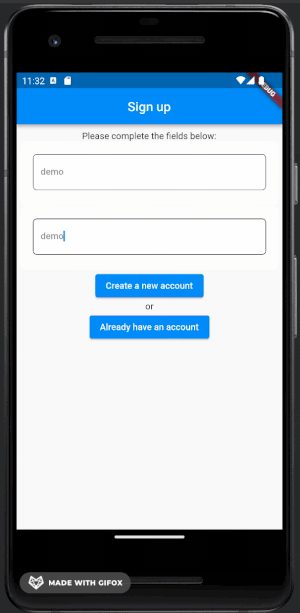
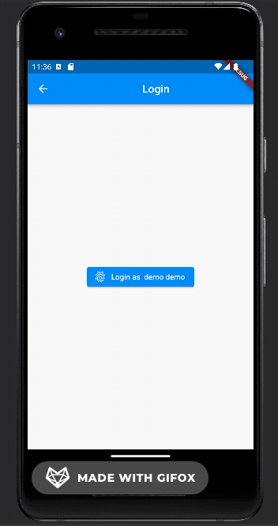

# flutter-webauthn-demo

This repository is a POC combining Flutter, Spring Boot and WebAuthn.



The API allows anonymous user registration and authentication using WebAuthn.
The project serves as an example on how to integrate a Flutter application with Spring Boot.

1. Install project `mvn install`

2. Expose your local API instance.
**The clients can call it from external network.**
`lt --port 8080 --host http://loca.lt -o`

3. Update the relyingParty identifier with your new temporary domain. For example:
```yaml
webauthn:
  relying-party-id: spotty-rings-remain-86-126-30-191.loca.lt
```
4. Update the origins to field to include requests from your android (flutter) application. Example:
```yaml
webauthn:
  relying-party-origins: android:apk-key-hash:t5OwAx-0r2saAq-IRdO8SuK_hkZWOglhkDSwg7OSpFE
```
5. Update the `assetlinks.json` file with your data
```yaml
[{
  "relation": ["delegate_permission/common.handle_all_urls"],
  "target": {
    "namespace": "android_app",
    "package_name": "com.example.flutter_app",
    "sha256_cert_fingerprints":
      ["B7:93:B0:03:1F:B4:AF:6B:1A:02:AF:88:45:D3:BC:4A:E2:BF:86:46:56:3A:09:61:90:34:B0:83:B3:92:A4:51"]
  }
}]
```
6. Check the available user ceremonies and how the webauthn library works: 
6. Register users. 

Create new account linked to new strong credential:
```bash
POST /api/registration/start HTTP/1.1
Content-Type: application/json;charset=UTF-8
Accept: application/json
Content-Length: 103
Host: localhost:8080

{"username":null,"registrationAddToken":null,"recoveryToken":null,"firstName":"Gica","lastName":"Hagi"}

HTTP/1.1 200 OK
X-Content-Type-Options: nosniff
X-XSS-Protection: 1; mode=block
Cache-Control: no-cache, no-store, max-age=0, must-revalidate
Pragma: no-cache
Expires: 0
X-Frame-Options: DENY
Content-Length: 686

{"status":"OK","registrationId":"uZ8w1CHeuGFlq+iDjd6hjQ==","publicKeyCredentialCreationOptions":{"rp":{"name":"localhost","id":"localhost"},"user":{"name":"4aee1347-5c65-43af-b21e-da33c903906d","displayName":"Gica Hagi","id":"AAAAAAAAAAE"},"challenge":"MC-GtpfdH3UYZpNIjW2Ipz8cPA8y36wXTMFsRqegrG4","pubKeyCredParams":[{"alg":-7,"type":"public-key"},{"alg":-257,"type":"public-key"}],"timeout":{"empty":true,"present":false},"excludeCredentials":{"empty":false,"present":true},"authenticatorSelection":{"empty":false,"present":true},"attestation":"none","extensions":{"appidExclude":{"empty":true,"present":false},"credProps":true,"largeBlob":{"empty":true,"present":false},"uvm":null}}}
```

Forward the Fido client response to finish user registration
```bash
POST /api/registration/finish HTTP/1.1
Content-Type: application/json;charset=UTF-8
Accept: application/json
Content-Length: 855
Host: localhost:8080

{
  "registrationId": "KukKik86leDlveDwJvGZVA==",
  "credential": {
    "type": "public-key",
    "id": "ARgxyHfw5N83gRMl2M7vHhqkQmtHwDJ8QCciM4uWlyGivpTf00b8TIvy6BEpBAZVCA9J5w",
    "rawId": "ARgxyHfw5N83gRMl2M7vHhqkQmtHwDJ8QCciM4uWlyGivpTf00b8TIvy6BEpBAZVCA9J5w",
    "response": {
      "clientDataJSON": "eyJ0eXBlIjoid2ViYXV0aG4uY3JlYXRlIiwiY2hhbGxlbmdlIjoidTZvVFJqSDlpdk5HVnRORGRKZ2VTYWItWHNibEt6TGw1VHRKaTJaUmpCOCIsIm9yaWdpbiI6Imh0dHA6Ly9sb2NhbGhvc3Q6ODA4MCIsImNyb3NzT3JpZ2luIjpmYWxzZX0",
      "attestationObject": "o2NmbXRkbm9uZWdhdHRTdG10oGhhdXRoRGF0YVi4SZYN5YgOjGh0NBcPZHZgW4_krrmihjLHmVzzuoMdl2NFYQFsmK3OAAI1vMYKZIsLJfHwVQMANAEYMch38OTfN4ETJdjO7x4apEJrR8AyfEAnIjOLlpchor6U39NG_EyL8ugRKQQGVQgPSeelAQIDJiABIVggRrK9x1qVGusI8SJ2mhhtl0eY2wN4jJgGhUnoefCZSrgiWCBXhX1M2HIdIZDENOvj5NRZY_rR51ylCXJuvA6UivFpxQ"
    },
    "clientExtensionResults": {}
  }
}

HTTP/1.1 200 OK
X-Content-Type-Options: nosniff
X-XSS-Protection: 1; mode=block
Cache-Control: no-cache, no-store, max-age=0, must-revalidate
Pragma: no-cache
Expires: 0
X-Frame-Options: DENY
Content-Length: 44

{"recoveryToken":"HMFWx5PwwSRR4ChtZGcnOg=="}
```
7. Authenticate.

Get a challenge for the registered user.

```bash
POST /api/assertion/start HTTP/1.1
Content-Type: application/json;charset=UTF-8
Accept: application/json
Content-Length: 26
Host: localhost:8080

{ "userId": "AAAAAAAAAAI"}

HTTP/1.1 200 OK
X-Content-Type-Options: nosniff
X-XSS-Protection: 1; mode=block
Cache-Control: no-cache, no-store, max-age=0, must-revalidate
Pragma: no-cache
Expires: 0
X-Frame-Options: DENY
Content-Length: 332

{"assertionId":"cAliVy6NfHYuIQ1KfTGxEw==","publicKeyCredentialRequestOptions":{"challenge":"m_BPnt9t5F_YGxqUqvYevBMqCXpexu0KUZYjtMY0q34","timeout":null,"rpId":"localhost","allowCredentials":[{"type":"public-key","id":"AAAAAAAAAHs","transports":null}],"userVerification":null,"extensions":{"appid":null,"largeBlob":null,"uvm":null}}}
```
From your Flutter application, validate the challenge from the previous step using the local strong credentials 

```bash
POST /api/assertion/finish HTTP/1.1
Content-Type: application/json;charset=UTF-8
Accept: application/json
Content-Length: 766
Host: localhost:8080

{
  "assertionId": "bWnC7+6A/fUcwjl048iPOQ==",
  "credential": {
    "type": "public-key",
    "id": "ARgxyHfw5N83gRMl2M7vHhqkQmtHwDJ8QCciM4uWlyGivpTf00b8TIvy6BEpBAZVCA9J5w",
    "rawId": "ARgxyHfw5N83gRMl2M7vHhqkQmtHwDJ8QCciM4uWlyGivpTf00b8TIvy6BEpBAZVCA9J5w",
    "response": {
      "clientDataJSON": "eyJ0eXBlIjoid2ViYXV0aG4uZ2V0IiwiY2hhbGxlbmdlIjoiVWVCWWtKdTRjdk5xeDZGRmk0cVNJTDhLSURveDBwcXlNUzlXNmJBYlRIOCIsIm9yaWdpbiI6Imh0dHA6Ly9sb2NhbGhvc3Q6ODA4MCIsImNyb3NzT3JpZ2luIjpmYWxzZX0",
      "authenticatorData": "SZYN5YgOjGh0NBcPZHZgW4_krrmihjLHmVzzuoMdl2MFYQFsow",
      "signature": "MEUCIFnff70nAto5eJTwyVHYgoi_E3013MOnbUVHJWIfaWbWAiEA9tw1WfZjTl1LOx3JF4-HQVPDhvVNVpRMXmtR2BN3m9I",
      "userHandle": "AAAAAAAAAAE"
    },
    "clientExtensionResults": {}
  }
}
HTTP/1.1 200 OK
X-Content-Type-Options: nosniff
X-XSS-Protection: 1; mode=block
Cache-Control: no-cache, no-store, max-age=0, must-revalidate
Pragma: no-cache
Expires: 0
X-Frame-Options: DENY
Content-Length: 20
set-cookie: JSESSIONID=12342432

{"username":"junit"}
```
